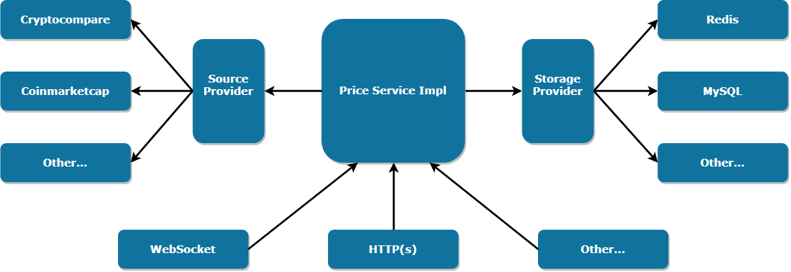
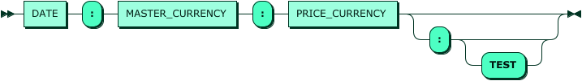

# ZXTrader's Price Service

ZXTrader's Price Service - Service of historical prices. Service is a caching aggregator of prices from few sources. Can working two mode the Demand (caching only the requested data) and Sync (full caching).

## Application schema architecture


## Configuration
The service is focused on launching in the Docker container and most of the parameters are set via environment variables. Specific settings made in the configuration INI file

### Environment variables
| Name | Default Value | Description |
| - | - | - |
| PRICE_MODE | DEMAND | The mode work of the service. In the case of Sync mode, the corresponding section in the INI file is required |
| DATASTORAGE_URL | redis://localhost:6379 | URL connect to the data store |
| HTTP_ENABLE | yes | Enable HTTP endpoint |
| HTTP_HOST | 127.0.0.1 | Specifies IP/hostname of the listening host for the HTTP endpoint |
| HTTP_PORT | 8080 | Specifies listening port number for HTTP endpoint |
| HTTPS_ENABLE | no | Enable HTTPS endpoint |
| HTTPS_HOST | 127.0.0.1 | Specifies IP/hostname of the listening host for the HTTPS endpoint |
| HTTPS_PORT | 8443 | Specifies listening port number for HTTPS endpoint |
| HTTPS_CACERTS | | List of CA certificates. File path or base64 string separated by commas |
| HTTPS_CERT | | Certificate of Service. File path or base64 string |
| HTTPS_KEY | | Private key service. File path or base64 string |
| HTTPS_KEY_PHASSPHRASE | | Password from the private key of service (specified in HTTPS_KEY) |

### Settings file
```
servers = 0 1

server.0.listenHost = localhost
server.0.listenPort = 8080
server.0.type = http

server.1.listenHost = localhost
server.1.listenPort = 8081
server.1.type = http

# Count endpoints
endpoints = 0 1

endpoint.0.type = rest
endpoint.0.servers = 0
endpoint.0.bindPath = /v0
endpoint.0.bindPathWeb = /

endpoint.1.type = rest
endpoint.1.servers = 1
endpoint.1.bindPath = /v1
endpoint.1.bindPathWeb = /

# Set list of sources providers
sources=cryptocompare zxtrader

# Configure the CryptoCompare provider. See: https://min-api.cryptocompare.com/
source.cryptocompare.url = http://blabla
source.cryptocompare.limit.parallel: 5
source.cryptocompare.limit.perSecond = 15
source.cryptocompare.limit.perMinute = 300
source.cryptocompare.limit.perHour = 8000
source.cryptocompare.timeout = 3000

# Configure the ZXTrader provider.
source.zxtrader.url = http://blabla
source.zxtrader.limit.parallel: 5
source.zxtrader.limit.perSecond = 15
source.zxtrader.limit.perMinute = 300
source.zxtrader.limit.perHour = 8000
source.zxtrader.timeout = 3000

# If enable mode Sync
sync.pairs=BTC:ETH,BTC:ZEC,BTC:USD,EUR:USD,EUR:BTC
```

## Service mode
> Sync mode don't implement yet.

* Demand - prices are cached only at the user's request (if external sources are not available, prices is don't exist in cache then it not available)
* Sync - service automatically copies all required prices (requires a lot of space in DataStorage compared to Demand mode)

## How to launch the service

### As Docker container
```bash
$ docker build --tag zxtrader.price.service . -f Dockerfile.redis
$ docker run --name zxtrader.price.service --rm -p 8080:8080 --detach zxtrader.price.service:latest
```

### Build from sources
```bash
$ npm install
$ npm run build
$ npm run start
```

### Run tests
```bash
$ npm install
$ npm run build
$ npm run test
```

## How to use the service

### REST API HTTP(S)

## Methods
* ping - [Ping](#ping) check status service.
* Single - [Historical rate (single)](#Historical-rate-(single)) Return single price or null.
* Batch - [Historical rates (batch)](#Historical-rates-(batch)) Return list key - prices.
* Multi sources - [Multi price from sources](#Multi-price-from-sources) Price from al sources.
* From source - [Price from source system](#Price-from-source-system) Price by one source system.
* Avarage - [Avarage price](#Avarage-price) Return avarage price all sources.
* Multi - [Multi request](#Multi-request) Return prices from all sources and avg price.

#### Ping
##### REST
```
$ curl --verbose https://service.zxtrader.com/exchanges/info/v0/api/ping?echo=hello

> GET /ping?echo=hello HTTP/1.1
> Host: ${SERVICE_HOST_NAME}:${SERVICE_PORT}
> Accept: */*
> 
< HTTP/1.1 200 OK
```
```json
{"echo":"hello","time":"2019-06-11T16:08:07.713Z","version":"1.0.0"}
```
##### JSON-RPC
```bash
$ wscat --connect wss://service.zxtrader.com/exchanges/info/v0/ws/jsonrpc
```
```json
connected (press CTRL+C to quit)
> {"jsonrpc":"2.0","id":42,"method":"ping","params":{"echo":"hello"}}
< {"jsonrpc":"2.0","id":42,"result":{"echo":"hello","time":"2019-06-25T17:24:32.660Z","version":"0.31.3"}}
```

#### Historical rate (single)
Get a historical rate
##### REST
* Date timezone: UTC
* Date format: YYYYMMDDHHmmss
* Response will be `null` if the service does not have rate value
```
curl --verbose --key license.key --cert license.crt https://service.zxtrader.com/v1/rate/single?exchange=BINANCE&date=20190627002015&market=USDT&trade=BTC
```
```
"13369.94000000"
```
or
```
null
```
##### JSON-RPC
```json
> {"jsonrpc":"2.0","id":42,"method":"rate/single",
	"params": {
		"exchange": "BINANCE",
		"date": "2018-01-01T10:20:10Z", 
		"market": "BTC", 
		"trade": "ZEC"
		}
	}
< {
	"jsonrpc":"2.0",
	"id":42,
	"result": "65.2312356"
}
```
or
```json
< {
	"jsonrpc":"2.0",
	"id":42,
	"result": null
}
```
#### Historical rates (batch)
Get batch of historical rates
* Date timezone: UTC
* Date format: YYYYMMDDHHmmss
* Response will be `null` if the service does not have rate value
##### REST
```bash
curl --verbose --key license.key --cert license.crt https://service.zxtrader.com/v1/rate/batch?items=20180101102010:BTC:ZEC,20180101102020:BTC:ETH,20180101102020:USDT:BTC
```
```
{
	"20180101102010:BTC:ZEC": "65.2312356",
	"20180101102020:BTC:ETH": "122.348754",
	"20180101102020:USDT:BTC": null
}
```
##### JSON-RPC
```json
--> {
	"jsonrpc":"2.0",
	"id":42,
	"method":"rate/batch",
	"params": [
			"20180101102010:BTC:ZEC",
			"20180101102020:BTC:ETH",
			"20180101102020:USDT:BTC"
		]
}
```
```json
<-- {
	"jsonrpc":"2.0",
	"id":42,
	"result": [
		"20180101102010:BTC:ZEC": "65.2312356",
		"20180101102020:BTC:ETH": "122.348754",
		"20180101102020:USDT:BTC": null
	]
}
```


#### Multi price from sources
HTTP Query grammar looks like [(see complete grammar)](docs/http-query-grammar.md):
[](docs/http-query-grammar.md)
##### REST
Get prices from all sources
```bash
$ curl --header 'Accept: application/json' https://service.zxtrader.com/price/v1/20180808190523:USDT:BTC:
```
```json
{
	"20180808190523": {
		"USD": {
			"BTC": {
				"avg": {
					"price": "6310.9138343"
				},
				"sources": {
					"CRYPTOCOMPARE": {
						"price": "6311.69"
					},
					"ZXTRADER": {
						"price": "6310.4138285"
					}
				}
			}
		}
	}
}
```
##### JSON-RPC
```
JSON-RPC don't implemented yet.
```
#### Price from source system
Get price from one source system example CRYPTOCOMPARE
##### REST
```json
$ curl --header 'Accept: application/json' https://service.zxtrader.com/price/v1/20180808190523:USDT:BTC:CRYPTOCOMPARE
```
```json
{
	"20180808190523": {
		"USD": {
			"BTC": {
				"avg": {
					"price": "6310.9138343"
				},
				"sources": {
					"CRYPTOCOMPARE": {
						"price": "6311.69"
					}
				}
			}
		}
	}
}
```
##### JSON-RPC
```
JSON-RPC don't implemented yet.
```

#### Avarage price
Get avarage price without sources system
##### REST
```json
$ curl --header 'Accept: application/json' https://service.zxtrader.com/price/v1/20180808190523:USDT:BTC
```
```json
{
	"20180808190523": {
		"USD": {
			"BTC": {
				"avg": {
					"price": "6310.9138343"
				}
			}
		}
	}
}
```
##### JSON-RPC
```
JSON-RPC don't implemented yet.
```

#### Multi request
Multi request from all sources
##### REST
```json
$ curl --header 'Accept: application/json' https://service.zxtrader.com/price/v1/20180808190523:USDT:BTC,20180808190523:USDT:ETH:,20180808190523:USDT:ZEC:CRYPTOCOMPARE
```
```json
{
	"20180808190523": {
		"USDT": {
			"BTC": {
				"avg": {
					"price": "6300.8379428533335"
				}
			},
			"ETH": {
				"avg": {
					"price": "357.95608886499997"
				},
				"sources": {
					"CRYPTOCOMPARE": {
						"price": "355.35"
					},
					"BINANCE": {
						"price": "360.72"
					},
					"POLONIEX": {
						"price": "360.40435546"
					}
				}
			},
			"ZEC": {
				"avg": {
					"price": "159.47"
				},
				"sources": {
					"CRYPTOCOMPARE": {
						"price": "159.47"
					}
				}
			}
		}
	}
}
```
##### JSON-RPC
```
JSON-RPC don't implemented yet.
```

## How to extend the service with a new source provider
All of you need is to write own implementation of a source provider interface and place in into `src/providers` directory. Take a look at the source provider interface in `src/providers/source/contract.ts`. Use `src/providers/source/random.ts` as example.

# Limits
> Limits function don't implement yet.

Limits are a limit on the count of service requests in order to protect the security of server against DoS attacks.

- Limits to the service can be set in the configuration INI file.
- The default service settings this feature is disabled.
- You can enable service limits with the parameter limit.use = true, after enabling the limits, you can create a profile (user type) and specify settings for it.
- Each request has its own weight, it can also depend on the number of parameters passed.

## General settings:
| Name | Type | Description |
| - | - | - |
| limit.use | boolean | Enable/disable limit requests
| limit.profile | boolean | Enable/disable limit on user category
| limit.profile.weight | number | Total amount of weight
| limit.profile.perSecond | number | Maximum number of requests per second
| limit.profile.perMinute | number | Maximum number of requests per minute
| limit.profile.perHour | number | Maximum number of requests per hour
| limit.profile.parallel | number | Maximum number of requests in parallel

## Example INI file:
```bash
limit.use=true

// Normal user settings
limit.user=true
limit.user.weight=800
limit.user.perSecond=10
limit.user.perMinute=600
limit.user.perHour=36000
limit.user.parallel=2

// Premium user  settings (Unlimited requests)
limit.premium=true
limit.premium.weight=0
limit.premium.perSecond=0
limit.premium.perMinute=0
limit.premium.perHour=0
limit.premium.parallel=0
```

# Data storage format in Redis
## Save price for source system:
```Bash

HSET "${HISTORY_PRICE_PREFIX}:${TS}:${MASTER_CURRENCY}:${PRICE_CURRENCY}:${SOURCE_SYSTEM}" "price" ${PRICE}
```
- ${HISTORY_PRICE_PREFIX} - constant "HISTORY:PRICE"
- ${TS} - time by price. format: YYYYMMDDHHMMSS
- ${MASTER_CURRENCY} - master currency code
- ${PRICE_CURRENCY} - price currency code
- ${SOURCE_SYSTEM} - source system name
- "price" - field name in the database
- ${PRICE} - price from source system
Example:
```Bash
HSET "HISTORY:PRICE:20180101100001:USDT:BTC:CRYPTOCOMPARE" "price" 13400.89
```

## Save average price for all sources system:
```Bash
HSET "${HISTORY_PRICE_PREFIX}:${TS}:${MASTER_CURRENCY}:${PRICE_CURRENCY}" "price" ${AVG_PRICE}
```
- ${HISTORY_PRICE_PREFIX} - constant "HISTORY:PRICE"
- ${TS} - time by price. format: YYYYMMDDHHMMSS
- ${MASTER_CURRENCY} - master currency code
- ${PRICE_CURRENCY} - price currency code
- "price" - field name in the database
- ${AVG_PRICE} - average price from all sources
Example:
```Bash
HSET "HISTORY:PRICE:20180101100001:USDT:BTC" "price" 13400.89
```

## Save source system name with pair
```Bash
HSET "${HISTORY_PRICE_PREFIX}:${TS}:${MASTER_CURRENCY}:${PRICE_CURRENCY}" ${SOURCE_SYSTEM}
```
- ${HISTORY_PRICE_PREFIX} - constant "HISTORY:PRICE"
- ${TS} - time by price. format: YYYYMMDDHHMMSS
- ${MASTER_CURRENCY} - master currency code
- ${PRICE_CURRENCY} - price currency code
- ${SOURCE_SYSTEM} - source system name
Example:
```Bash
HSET "HISTORY:PRICE:20180101100001:USDT:BTC" "CRYPTOCOMPARE"
```

# HTTP status code
- HTTP 200 return code when request successful.
- HTTP 404 return code when not found page.
- HTTP 429 return code is used when breaking a request rate limit.
- HTTP 500 return codes are used for internal errors; the issue is on service's side.
