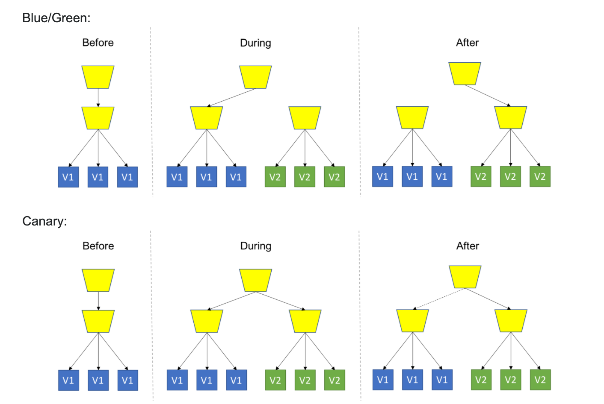

# Cryptopay's Kubernetes Deployment

## Releases

Pipelines для релизов формируются с помощью создания тега с соответствущим суффиксом.

Суффиксы для тегов:

* `-runtime` - Набор задач по деплойменту с использованием `Helm 3`
* `-runtime-helm2` - Набор задач по деплойменту с использованием `Helm 2`
* `-database` -  Набор задач по деплойменту миграций базы данных

### Runtime Helm Releases

**Runtime** - мы называем Helm Chart описывающий сборку всего набора сервисов с привязкой к 

Tag name format: `<APP_VERSION>-runtime`

Создание тега в таком формате, создаст pipeline с набором задач для деплоймента сервисов. `APP_VERSION` это версия Chart.yaml `appVersion`.

Например:
* [2.0.0-alpha01-runtime](https://gitlab.wnb:28443/cryptopay/devops/kubernetes-deployment/-/tags/2.0.0-alpha01-runtime)
* [runtime-2.0.1-runtime](https://gitlab.wnb:28443/cryptopay/devops/kubernetes-deployment/-/tags/2.0.1-runtime)
* etc

NOTE! Перед созданием тега, вы должны убедиться, что релизные контейнеры сервисов выложены в репозитории контейнеров.

NOTE! Во время переходной фазы на `Helm 3` остаются возможность создать наборы задач под `Helm 2`. Для этого используйте суффикс `<APP_VERSION>-runtime-helm2`.

#### Zero downtime deployment (Blue/Green)

Для обеспечения **zero downtime deployment** стратегии, мы используем подход приближенный к [Canary](https://martinfowler.com/bliki/CanaryRelease.html). Деплой `runtime` chart выполняется с именами Helm релизов `Blue` и `Green`.

* `Blue` - это основной инстанс обрабатывающий нагрузку
* `Green` - это дополнительный инстанс который создается во время нового релиза (живет короткое время)



Условно, стратегия сводится к следующим шагам:

1. Имеем работающую сборку `runtime vX.X.X` задеплоен под Helm релизом `Blue`. Helm релиза `Green` нет в кластере (имеем только `Blue`)
1. Подготовили новую сборку `runtime vY.Y.Y` и выполняем деплой под Helm релизом `Green`. В этот доступно следующее:
	* Продуктивный трафик продолжает направляться ТОЛЬКО на Helm релиз `Blue`
	* К Helm релизу `Green` есть подключение через внутренний домен `***-green-cryptopay.prodcryptopay.kube`(PROD) для проведения [Smoke testing](https://en.wikipedia.org/wiki/Smoke_testing_(software)) по новой функциональности.
	* Если в процессе тестирования обнаружены деффекты, Helm релиз `Green` удаляется и команда работает над исправлением деффектов. ТУТ КОНЕЦ (итого имеем состояние как на шаге 1).
1. Переключаем продуктивный трафик (возможно постепенно 10%, 25%, 50%, 100%) на использование Helm релиза `Green`
1. Ожидаем завершения всех фоновых задач процессинга на Helm релизе `Blue`
1. Выполняем деплой сборки `runtime vY.Y.Y` под Helm релизом `Blue`
1. Переключаем продуктивный трафик (возможно постепенно 10%, 25%, 50%, 100%) на использование Helm релиза `Blue`
1. Ожидаем завершения всех фоновых задач процессинга на Helm релизе `Green`
1. Удаляем Helm релиз `Green`. ТУТ КОНЕЦ (итого имеем состояние как на шаге 1).


### Database Releases

Tag name format: `<DB_VERSION>-database`

Создание тега в таком формате, создаст pipeline с набором задач для деплоймента базы версии `DB_VERSION`.
Например:
* [v02.00-database](https://gitlab.wnb:28443/cryptopay/devops/kubernetes-deployment/-/tags/v02.00-database)
* [v02.01-database](https://gitlab.wnb:28443/cryptopay/devops/kubernetes-deployment/-/tags/v02.01-database)
* etc

NOTE! Перед созданием тега, вы должны убедиться, что [релизные контейнеры](https://gitlab.wnb:28443/cryptopay/database/pipelines) с версией [`DB_VERSION`](https://gitlab.wnb:28443/cryptopay/database/-/tags) выложены в репозитории контейнеров (прод контейнер в продовский репозиторий)

## Snapshots

### Runtime Snapshot

Запустите Pipeline с переменной `SNAPSHOT_RUNTIME` со значением = `master` или `dev`. Это создаст pipeline с набором задач для деплоймента сервисов из соответсвующего бранчей.

Пример триггера
```bash
export DEPLOY_PIPELINE_TOKEN=...
curl --insecure -X POST -F "token=${DEPLOY_PIPELINE_TOKEN}" -F "ref=master" -F "variables[SNAPSHOT_RUNTIME]=dev" https://gitlab.wnb:28443/api/v4/projects/684/trigger/pipeline
```
### Database Snapshot

Запустите Pipeline с переменной `SNAPSHOT_DATABASE` = `dev.57e5a60e`, где [`dev.57e5a60e`](https://gitlab.wnb:28443/cryptopay/database/pipelines) тег от образа с миграцией базы данных.

Пример триггера
```bash
export DEPLOY_PIPELINE_TOKEN=...
curl --insecure -X POST -F "token=${DEPLOY_PIPELINE_TOKEN}" -F "ref=master" -F "variables[SNAPSHOT_DATABASE]=dev.57e5a60e" https://gitlab.wnb:28443/api/v4/projects/684/trigger/pipeline
```


## HELM Notes

### Get started
1. Make configuration file for `kubectl` application (setup ~/.kube/config)
1. Set alias to HELM
	```bash
	$ cd_cryptopay
	$ cd devops.kubernetes-deployment/runtime/
	# Set "helm" docker alias if you does not have Helm locally. Choose one of following:
	$ alias helm="docker run --interactive --tty --rm --volume \"${HOME}/.kube/config:/root/.kube/config\" --volume \"$(pwd):/apps\" --entrypoint /usr/bin/helm harbor.infra.kube/infra/helm:3"
	$ alias helm="docker run --interactive --tty --rm --volume \"${HOME}/.kube/config:/root/.kube/config\" --volume \"$(pwd):/apps\" alpine/helm:3.2.0"
	```
1. Set environment
	```bash
	$ export ENV=evolution
	$ export ENV=presentation
	$ export ENV=preproduction
	```
### Useful commands
See full doc https://v3.helm.sh/docs/helm

#### List
```bash
$ helm --namespace "cryptopay-${ENV}" list --all
NAME             	REVISION	UPDATED                 	STATUS  	CHART                  	APP VERSION	NAMESPACE
???
```

#### Delete the release from Kubernetes
Full delete `tag` for example
```bash
$ helm --namespace "cryptopay-${ENV}" uninstall Blue
```

#### Deploy the service into cluster
```bash
$ helm --namespace "cryptopay-${ENV}" upgrade --install --history-max 3 --values "values-base.yaml" --values "values.${ENV}.yaml" Blue .
```

```bash
$ helm --namespace "cryptopay-${ENV}" upgrade --install --history-max 3 --values "values-base.yaml" --values "values.${ENV}.yaml" --set "application.processing.serviceImage=devdocker.infra.kube/cryptopay/cpservice/snapshot" --set "application.processing.tag=2-1-38-hotfix" tag .
```

```bash
$ helm --namespace "cryptopay-${ENV}" upgrade --install --history-max 3 --values "values-base.yaml" --values "values.${ENV}.yaml" --set "application.processing.tag=master" --set "application.api.tag=master" tag .
```


## Kubectl Notes

### Get started
1. Make configuration file for `kubectl` application (setup ~/.kube/config)

### Backup all secrets

```bash
kubectl --namespace=cryptopay-evolution get --output=yaml secrets | tee bakup-cryptopay-evolution-secrets.yaml
```
