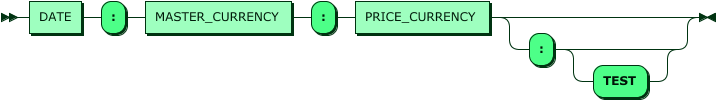

# ZXTrader's Price Service

ZXTrader's Price Service - сервис исторических цен. Сервис является кеширующим агрегатором цен из внешних источников. Позволяет работать в режиме Demand(кеширование только запрашиваемых данных) и Sync(полное кеширование)

## Configuration
Сервис ориентирован на запуск в Docker контейнере и большая часть параметров устанваливается через переменные окружения. Специфические настройки вынесены в конфигурационный INI файл

### Environment variables
| Name | Default Value | Description |
| - | - | - |
| PRICE_MODE | demand | Режим работы сервиса. В случае режима sync требутся соответсвующая секция в INI файле |
| DATASTORAGE_URL | redis://localhost:6379 | URL для подключения к хранилищу данных |
| HTTP_ENABLE | yes | Включает HTTP ендпоинт |
| HTTP_HOST | 127.0.0.1 | Указывает IP/имя слушающего хоста для HTTP ендпоинта |
| HTTP_PORT | 8080 | Указывает номер слушающего порта для HTTP ендпоинта  |
| HTTPS_ENABLE | no | Включает HTTPS ендпоинт |
| HTTPS_HOST | 127.0.0.1 | Указывает IP/имя слушающего хоста для HTTPS ендпоинта |
| HTTPS_PORT | 8443 | Указывает номер слушающего порта для HTTPS ендпоинта  |
| HTTPS_CACERTS | | Список доверенных CA сертификатов. Путь к файлу или base64 строка разделенные запятыми |
| HTTPS_CERT | | Сертификат сервиса. Путь к файлу или base64 строка  |
| HTTPS_KEY | | Приватный ключ сервиса. Путь к файлу или base64 строка |
| HTTPS_KEY_PHASSPHRASE | | Пароль от приватного ключа сервиса (указанного в HTTPS_KEY) |

### Settings file
```
# Задаем список провайдеров цен
sources=cryptocompare zxtrader

# Настраиваем провадер CryptoCompare. Смотрите https://min-api.cryptocompare.com/
source.cryptocompare.url = http://blabla
source.cryptocompare.limit.parallel: 5
source.cryptocompare.limit.perSecond = 15
source.cryptocompare.limit.perMinute = 300
source.cryptocompare.limit.perHour = 8000
source.cryptocompare.timeout = 3000

# Настраиваем провадер ZXTrader
source.zxtrader.url = http://blabla
source.zxtrader.limit.parallel: 5
source.zxtrader.limit.perSecond = 15
source.zxtrader.limit.perMinute = 300
source.zxtrader.limit.perHour = 8000
source.zxtrader.timeout = 3000

# Настройки режима работа sync
sync.pairs=BTC:ETH,BTC:ZEC,BTC:USD,EUR:USD,EUR:BTC
```

## Service mode
* Demand - кешируются цены только по запросу пользователя (в случае недоступности внешних источников, отсутствующие в кеше цены - недоступны)
* Sync - сервис автоматически кеширует все требуемые цены (требует много места в DataStorage в сравнении с режимом Demand)


## How to launch the service

### As Docker container
```bash
$ docker run --name zxtrader-price-service zxtrader/price-service-bundle:latest
```

### Build from sources
```bash
$ npm install
$ npm run build
$ npm start
```

## How to use the service

### HTTP(S)
HTTP Query grammar looks like (see complete grammar):
[](docs/http-query-grammar.md)

Simple query with result as text
```bash
$ curl --header 'Accept: text/plain' https://service.zxtrader.com/price/v1/20180808190523:USD:BTC
13400.89
```
Simple query with result as JSON
```bash
$ curl --header 'Accept: application/json' https://service.zxtrader.com/price/v1/20180808190523:USD:BTC
{
	"20180808190523": {
		"USD": {
			"BTC": {
				"avg": {
					"price": "13400.9"
				},
				"sources": {
					"cryptocompare": {
						"price": "13400.89"
					},
					"zxtrader": {
						"price": "13400.91"
					}
				}
			}
		}
	}
}
```


### WebSoket
TBD

## How to extend the service with a new currency provider
All of you need is to write own implementation of a CurrencyProvider interface and place in into `src/providers` directory. Take a look at the CurrencyProvider interface in `src/contract.ts`. Use `src/providers/random.ts` as example.
