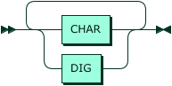

# HTTP query grammar

## Examples
Average price for 2018-08-08T19:05:23
```
https://service.zxtrader.com/price/v1/20180808190523:USD:BTC
```

Average price + single source for 2018-08-08T19:05:23 and BINANCE
```
https://service.zxtrader.com/price/v1/20180808190523:USD:BTC:BINANCE
```

Average price + prices of all sources 2018-08-08T19:05:23
```
https://service.zxtrader.com/price/v1/20180808190523:USD:BTC:
```

Several prices at once
```
https://service.zxtrader.com/price/v1/20180808190523:USD:BTC:BINANCE,20180808190524:USD:BTC:BINANCE,20180808190525:USD:BTC:BINANCE
```

## Date representation is yyyyMMddHHmmss
Some developers have problems with: How to convert date
```bash
date '+%Y%m%d%H%M%S'
20190417194034
```

```js
// Java Script
const date = new Date("Mon Apr 16 2018 19:00:00 GMT-0500");
const custom = moment(date).format("YYYYMMDDHHmmss"); // 20180416190000
const momentDateUnix = moment.utc(date, "YYYYMMDDHHmmss").unix().toString(); // 1523905200
```

```java
// Java
SimpleDateFormat DATE_TIME_FORMAT = new SimpleDateFormat("yyyyMMddHHmmss");
DATE_TIME_FORMAT.parse("20180808190523");
DATE_TIME_FORMAT.format(new Date())
```

```csharp
// C#
DateTime.ParseExact("20180808190523", "yyyyMMddHHmmss", CultureInfo.InvariantCulture);
DateTime.Now.ToString("yyyyMMddHHmmss"); 
```


## EBNF
```ebnf
URL_QUERY       ::= QUERY (',' QUERY)+
QUERY           ::= DATE ':' MASTER_CURRENCY ':' PRICE_CURRENCY (':' ('TEST')?)?
MASTER_CURRENCY ::= CURRENCY
PRICE_CURRENCY  ::= CURRENCY
PRICE_MAKER     ::= CURRENCY
CURRENCY        ::= (CHAR | DIG)+
DATE            ::= DIG DIG DIG DIG DIG DIG DIG DIG DIG DIG DIG DIG DIG DIG
DIG             ::= [0-9]
CH              ::= [A-Z]
```

### URL_QUERY


### QUERY


### MASTER_CURRENCY


### PRICE_CURRENCY


### PRICE_MAKER


### CURRENCY


### DATE


### DIG


### CH


https://www.bottlecaps.de/rr/ui

